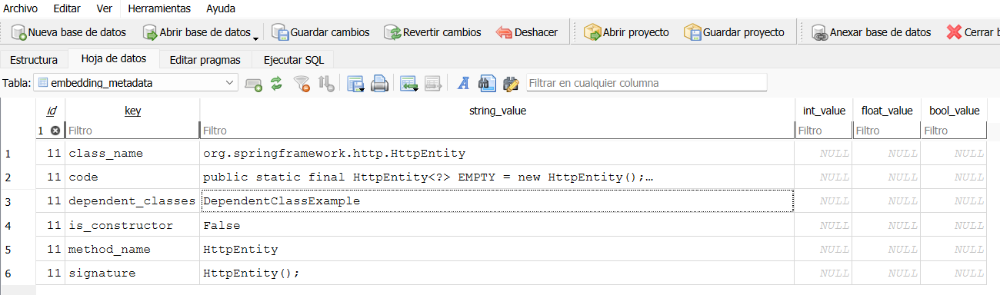

# :mega: ChatUnitest Core

[English](./README.md) | [中文](./Readme_zh.md)

## Motivation
Many have attempted to use ChatGPT to assist with various programming tasks, achieving good results. However, there are some challenges with directly using ChatGPT: First, the generated code often fails to execute correctly, leading to the saying **"five minutes of coding, two hours of debugging"**; second, integrating with existing projects is cumbersome, requiring manual interaction with ChatGPT and switching between different pages.

To address these issues, we propose a **"Generate-Validate-Fix"** framework and have developed a prototype system. To facilitate usage, we created several plugins that can easily integrate into existing development workflows. We have completed the development of the Maven plugin, and the latest version has been released to the Maven Central Repository for your trial and feedback. Additionally, we have launched the Chatunitest plugin in the IntelliJ IDEA Plugin Marketplace. You can search for and install ChatUniTest in the marketplace or visit the plugin page [Chatunitest: IntelliJ IDEA Plugin](https://plugins.jetbrains.com/plugin/22522-chatunitest) for more information. This latest branch integrates several related works we have reproduced, allowing you to choose according to your needs.

## :rocket: Extended Functionality — SOFIA and RAG

### SOFIA: Enhanced Context through External Dependencies
The ChatUnitest framework has been extended with **SOFIA**, a module developed by a team contributor, **david-lnk** ([GitHub repository](https://github.com/davidlnk/chatunitest-core-sofia)). SOFIA enriches the generation process by automatically retrieving relevant information from external dependencies. This additional context provides a deeper understanding of the target code, especially when working with layered architectures or external libraries, ultimately improving the quality and relevance of the generated unit tests.

### RAG Integration: Efficient Context Selection
To further optimize the system, a **Retrieval-Augmented Generation (RAG)** module has been added on top of SOFIA. This RAG component, developed as part of this fork, filters and selects only the most relevant pieces of contextual information. This selective retrieval process allows for a **reduction of approximately 50% in prompt size**, leading to:

- 🔄 **Faster test generation times**
- 🧠 **Improved generation quality**
- 📉 **Lower token usage**

Despite using less context, RAG achieves **equal or even superior results** in terms of output quality, especially noticeable in reduced latency and improved responsiveness.

## How to Run the RAG System

To enable the RAG module, you need to start the local embedding retrieval server:

```bash
python embeddingrest.py
```

Now, the file it's located on 

```bash
src\main\java\zju\cst\aces\util
```

Feel free to move the file to a different directory if that works better for your setup.

### 🔧 Configuring Context Ratio for RAG

To adjust the percentage of context used by the RAG (Retrieval-Augmented Generation) system, navigate to the following file in the project:

```bash
src\main\java\zju\cst\aces\api\config\Config.java
```

Inside `Config.java`, locate the parameter responsible for the context ratio (e.g., `ragPercent`) and modify its value as needed. This value determines the portion of retrieved context that will be included during generation.

Make sure to recompile the project after making changes for them to take effect.

### Default Port

By default, this server runs on [http://localhost:5000](http://localhost:5000).  
You can check its status by visiting this URL in your browser, where a confirmation message will appear.

### Changing the Port

If you need to change the default port:

1. Modify the port number in `embeddingrest.py`.
2. Update the corresponding URL in `EmbeddingClient.java`.

Make sure both settings match to ensure proper communication.

---

## Overview

### Running Steps

#### 0. Build the Core

```shell
mvn clean install
```

#### 1. Add the Dependency

Add the following dependency to the `pom.xml` file of the Maven plugin.  
Ensure the version in the core's `pom.xml` matches the version of the imported dependency.

```xml
<dependency>
    <groupId>io.github.ZJU-ACES-ISE</groupId>
    <artifactId>chatunitest-core</artifactId>
    <version>2.0.0</version>
</dependency>
```

#### 2. Subsequent Steps

For detailed instructions, please refer to the Maven plugin section:  
➡️ [chatunitest-maven-plugin/corporation](https://github.com/ZJU-ACES-ISE/chatunitest-maven-plugin/)

---

### 🗂️ Check BDD Information
When you run `embeddingrest.py`, which is located in:

```shell
src\main\java\zju\cst\aces\util
```

a folder named `chroma` will be generated in the same directory where the script is located. This folder contains the database used to store information for the RAG system.

You can inspect the contents of this database using tools such as [DB Browser for SQLite](https://sqlitebrowser.org/). Once opened, you can find detailed stored information under the `embedding_metadata` table, which includes metadata associated with the embedded documents.

This is useful for verifying what content has been indexed and is being used during retrieval.

Example:


## Custom Content

### Using FTL Templates

1. **Configure Mapping**  
   Define the mapping in the `config.properties` file.

2. **Define the PromptFile Enum**  
   Define enum constants and their corresponding template filenames in the `PromptFile` enum class.

3. **Reference Templates**  
   Reference the `PromptFile` templates in the `getInitPromptFile` and `getRepairPromptFile` methods of the `PromptGenerator` class.

4. **Generate Prompts**  
   Call the `generateMessages` method of the `PromptGenerator` to obtain the prompt.  
   For specific implementation details, please refer to the HITS implementation.

### Extending FTL Templates

- `PromptInfo` is a data entity class that can be extended as needed.
- The `dataModel` in `PromptTemplate` holds the variable data used by the FTL templates.
- If you introduce new variables in a custom FTL template, ensure that you update the `dataModel` accordingly.

### Modifying the Granularity of Generated Unit Tests

You can create a subclass of `MethodRunner`, similar to `HITSRunner`, and add new implementations in the `selectRunner` method.

### Custom Unit Test Generation Scheme

If you wish to define your own unit test generation scheme, here is an example:

- Define a subclass of `PhaseImpl` to implement the core generation scheme (typically placed in the `phase/solution` folder).
- Add new implementations in the `createPhase` method of the `PhaseImpl` class.
- If you have new templates, refer to the section on **Using FTL Templates**.
- If there are new data variables, see the section on **Extending FTL Templates**.
- If you need to modify the granularity of the generated unit tests (e.g., method slicing), refer to the section on **Modifying the Granularity of Generated Unit Tests**.

---

## :email: Contact Us

If you have any questions, please feel free to contact us via email:

- 📬 Corresponding author: `zjuzhichen AT zju.edu.cn`
- 👨‍💻 Authors: `yh_ch AT zju.edu.cn`, `xiezhuokui AT zju.edu.cn`
- 🛠️ SOFIA module: `david-lnk`
- 🔍 RAG & bugfixes: `alejandrorodm`

